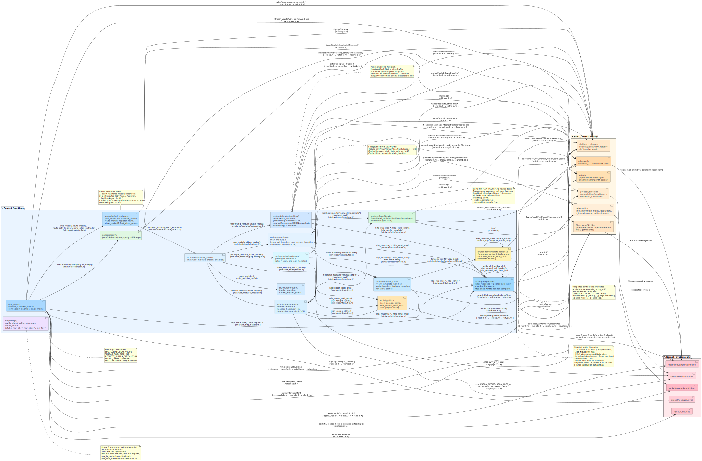

# MiniWeb — OpenBSD System Monitoring Server

[](https://www.openbsd.org/)
[](LICENSE)
[](https://en.wikipedia.org/wiki/C99)

## Name

`miniweb` — lightweight HTTP server for OpenBSD system monitoring.

## Synopsis

```sh
./build/miniweb [-h] [-v] [-b address] [-c connections] [-f file] [-p port] [-t threads]
```

## Description

MiniWeb is a lightweight HTTP server written in C99 for OpenBSD. It provides a system monitoring dashboard, a RESTful JSON API, and an integrated manual page browser.

Runtime architecture is based on a single `kqueue(2)` dispatcher thread plus worker threads. Connections are accepted, enqueued once with `EV_DISPATCH`, processed by workers, then closed. This eliminates worker races on the same fd and avoids busy-waiting.

Security hardening is enabled from startup using `pledge(2)` and `unveil(2)`. Metrics are gathered through native interfaces (`sysctl(2)`, `getloadavg(3)`, `getifaddrs(3)`, `getmntinfo(3)`) without external commands. Manual page rendering is delegated to `mandoc(1)` with a timeout.

MiniWeb does not implement TLS directly. Production deployment is intended behind `relayd(8)` for TLS termination.

At startup, MiniWeb loads configuration from file (if found), then applies CLI overrides.


## Features

- Real-time metrics: CPU load, memory, swap, disk usage, network interfaces
- Process monitoring: top 10 by CPU and top 10 by memory
- Manual page browser: search via `apropos(1)` and render with `mandoc(1)`
- Security hardening with `pledge(2)` + `unveil(2)`
- High-performance event loop with `kqueue(2)` + worker thread pool
- RESTful JSON API for external integrations
- No native TLS by design (run behind `relayd(8)`)

## Quick Start

### Prerequisites

- OpenBSD 7.8 or later
- Base development tools (`clang`, `make`)
- Optional benchmark tooling: `wrk`, `gnuplot`

### Build

```sh
make clean && make
```

### Build man page

```sh
make man
```

### Run unit tests

```sh
make unit-tests
```

### Run

```sh
./build/miniweb -v
```

Open <http://127.0.0.1:9001>.

## Usage

```text
./build/miniweb [options]

  -f FILE   Config file path (default: auto-detect)
  -p PORT   Port to listen on        (default: 9001)
  -b ADDR   Address to bind to       (default: 127.0.0.1)
  -t NUM    Worker thread count      (default: 4)
  -c NUM    Max concurrent conns     (default: 1280)
  -v        Verbose logging to stderr
  -h        Show this help
```

## Endpoints

Responses follow HTTP/1.1 connection semantics: keep-alive is enabled by default for
HTTP/1.1 unless the client sends `Connection: close`.
Handlers may also force close behavior, and each connection is capped at 64 served
requests before being closed.

### Web Interface

| Endpoint | Description |
|---|---|
| `GET /` | Dashboard with system overview |
| `GET /docs` | Manual page browser with `apropos(1)` search |
| `GET /networking` | Interfaces, routes, DNS configuration |
| `GET /apiroot` | API index page |

### Add or Remove Regular Pages (`/`, `/docs`, ...)

Template-backed pages are declared in `view_routes[]` in `src/urls.c`.

To add a page (example: `/about`):

1. Create templates in `templates/`:
   - `about.html`
   - `about_extra_head.html` (optional)
   - `about_extra_js.html` (optional)
2. Add route entry in `src/urls.c`:

```c
{"GET", "/about", "MiniWeb - About", "about.html",
 "about_extra_head.html", "about_extra_js.html"},
```

3. Rebuild:

```sh
make clean && make
./build/miniweb -v
```

To remove a page, remove the corresponding `view_routes[]` entry and rebuild.

### Metrics API

| Endpoint | Response |
|---|---|
| `GET /api/metrics` | Full JSON system snapshot |
| `GET /api/networking` | Interfaces, routes, resolver JSON |

`/api/metrics` includes hostname, OS version, uptime, load averages, memory, swap, per-filesystem disk usage, network status, top process lists (CPU/memory), and process counters.

### Manual Pages API

| Endpoint | Description |
|---|---|
| `GET /api/man/search?q=query` | Raw `apropos(1)` output (`text/plain`) |
| `GET /man/{area}/{section}/{page}` | HTML (default) |
| `GET /man/{area}/{section}/{page}.html` | HTML |
| `GET /man/{area}/{section}/{page}.md` | Markdown |
| `GET /man/{area}/{section}/{page}.pdf` | PDF |
| `GET /man/{area}/{section}/{page}.ps` | PostScript |

### Static Files

| Endpoint | Description |
|---|---|
| `GET /static/*` | CSS, JS, images (rejects `..` and `//`) |
| `GET /favicon.ico` | `static/assets/favicon.svg` as `image/svg+xml` |

## Architecture

### Project Structure

```text
.
├── Makefile
├── README.md
├── benchmark.sh
├── build/
├── docs/
├── include/
├── src/
├── static/
├── templates/
└── tests/
```

### Codebase diagram



### Request Lifecycle

```text
accept()
   │
   ▼
kqueue dispatcher (main thread)
   │  EV_DISPATCH → event auto-disabled after delivery
   ▼
work queue (pthread_cond_wait, zero busy-waiting)
   │
   ▼
worker thread (1 of N)
   │  recv() → parse → route_match() → handler()
   ▼
close(fd) + free_connection()
```

Main thread handles accept + queueing only; workers never call `kevent()`. `EV_DISPATCH` ensures one worker handles one readiness event.

### Key Components

- `src/main.c`: dispatcher + pool, fd-indexed connection table, generation checks, idle timeout sweeps
- `src/metrics.c`: metrics via `sysctl(2)` and other native interfaces with retry loop for `KERN_PROC_ALL`
- `src/http_handler.c`: thread-safe request scratch buffers for header/client-IP helpers
- `src/template_engine.c`: simple `{{TOKEN}}` substitution from `templates/`

## Performance

Measured on OpenBSD 7.8, amd64, 4-core CPU:

| Endpoint | Throughput | Avg latency |
|---|---|---|
| `/static/test.html` | **34,771.76 req/s (peak)** | **0.220 ms (best avg)** |
| `/api/metrics` | ~300 req/s | — |

Compared to an earlier static baseline around ~7,000 req/s, peak throughput gain is about **+396.74%** (~4.97×).

## Security

### Sandboxing

`unveil(2)` restricts to:

```text
templates/          r
static/             r
/usr/share/man      r
/usr/local/man      r
/usr/X11R6/man      r
/usr/bin/mandoc     x
/usr/bin/man        x
/usr/bin/apropos    x
/bin/ps             x
/usr/bin/netstat    x
/bin/sh             x
/etc/man.conf       r
/etc/passwd         r
/etc/group          r
/etc/resolv.conf    r
```

`pledge(2)` promises:

```text
stdio rpath inet route proc exec vminfo ps getpw
```

### Additional mitigations

- Static traversal protection (`..`, `//` rejected)
- Connection cap with immediate 503 for excess clients
- Sanitization of manual page path components before `mandoc(1)` execution
- Forwarded headers trusted only from `trusted_proxy`

### Known limitations

- No built-in TLS
- No authentication layer
- Some JSON fields can be truncated by fixed-size buffers
- Timeout logic cannot preempt kernel-level stalls inside `mandoc(1)`

## Reverse Proxy

MiniWeb is designed to run behind `relayd(8)`.

When proxied, client identity/protocol are read in this order:

1. `X-Real-IP`
2. `X-Forwarded-For` (first value)
3. Socket peer address

`X-Forwarded-Proto` should be set to `https` by the proxy for original TLS connections.

### relayd example

```conf
table <miniweb> { 127.0.0.1 }

http protocol "https_proxy" {
    tls

    match request header set "X-Forwarded-For"   value "$REMOTE_ADDR"
    match request header set "X-Forwarded-Proto" value "https"
    match request header set "X-Real-IP"         value "$REMOTE_ADDR"
    match request header set "Host"              value "$HOST"

    tcp { nodelay }
}

relay "https_frontend" {
    listen on egress port 443 tls
    protocol "https_proxy"
    forward to <miniweb> port 9001
}

relay "http_redirect" {
    listen on egress port 80
    forward to <miniweb> port 9001
}
```

## Configuration File

Search order (first match wins):

1. `-f /path/to/file` (explicit, failure is fatal)
2. `./miniweb.conf`
3. `$HOME/.miniweb.conf`
4. `/etc/miniweb.conf`

CLI flags override file values. Unknown directives produce warnings without aborting startup.

### Format

```text
# comment
key    value
```

### Directives

| Key | Default | Description |
|---|---|---|
| `port` | `9001` | TCP port |
| `bind` | `127.0.0.1` | IPv4 bind address |
| `threads` | `4` | Worker thread count |
| `max_conns` | `1280` | Max concurrent connections |
| `conn_timeout` | `30` | Idle timeout (seconds) |
| `max_req_size` | `16384` | Max request size (bytes) |
| `mandoc_timeout` | `10` | `mandoc(1)` timeout (seconds) |
| `static_dir` | `static` | Static assets directory |
| `templates_dir` | `templates` | Templates directory |
| `mandoc_path` | `/usr/bin/mandoc` | `mandoc(1)` binary path |
| `trusted_proxy` | `127.0.0.1` | Trusted proxy IP for forwarded headers |
| `verbose` | `no` | `yes/no/true/false/1/0` |

## Files

- `./miniweb.conf`, `$HOME/.miniweb.conf`, `/etc/miniweb.conf` — startup config search list
- `templates/` — HTML templates
- `static/` — assets served under `/static/`
- `/etc/passwd`, `/etc/group`, `/etc/resolv.conf` — lookups/data for runtime views
- `/etc/man.conf`, `/usr/share/man`, `/usr/local/man`, `/usr/X11R6/man` — manpage data
- `/usr/bin/mandoc`, `/usr/bin/apropos`, `/bin/ps`, `/usr/bin/netstat`, `/bin/sh` — executed helpers

## Examples

```sh
miniweb -v
miniweb -f /etc/miniweb.conf
miniweb -f /etc/miniweb.conf -p 8080
miniweb -b 0.0.0.0 -p 8080 -t 8
miniweb -b 127.0.0.1 -p 9001 -c 1280 -t 4
curl -s http://127.0.0.1:9001/api/metrics | jq .
```

Proxy smoke-check:

```sh
for p in / /docs /apiroot /networking \
      /api/metrics /api/networking \
      /static/css/custom.css /favicon.ico; do
  printf '%-30s %s\n' "$p" \
    "$(curl -sk -o /dev/null -w '%{http_code}' https://example.com$p)"
done
```

### OpenBSD rc.d service

Esempio di script `/etc/rc.d/miniweb`:

```sh
#!/bin/ksh

daemon="/home/flavio/DEV/miniweb/build/miniweb"
daemon_flags="-f /etc/miniweb.conf"
daemon_user="flavio"

. /etc/rc.d/rc.subr

rc_bg=YES
rc_cmd $1
```

## Development

### Testing

```sh
make unit-tests

for p in / /docs /apiroot /networking \
          /api/metrics /api/networking \
          /static/css/custom.css /favicon.ico; do
    printf '%-30s %s\n' "$p" \
      "$(curl -s -o /dev/null -w '%{http_code}' http://127.0.0.1:9001$p)"
done

curl -s 'http://127.0.0.1:9001/api/man/search?q=pledge'
curl -s http://127.0.0.1:9001/api/metrics | jq .
```

### Debug build

```sh
make DEBUG=1
./build/miniweb -v
```

## Troubleshooting

- `bind: Address already in use`: another process already owns the port
- `pledge: Operation not permitted`: syscall outside current promise set
- `sysctl data query failed: Cannot allocate memory`: process table changed during collection
- `[write_all] Too many EAGAIN retries`: slow/unresponsive client, connection dropped
- Man pages not rendering: verify `mandoc` path + unveil permissions, run with `-v`

## Roadmap

- [ ] WebSocket support for live metric streaming
- [ ] Historical data with ring-buffer storage and graphs
- [ ] Alert thresholds and notifications
- [ ] IPv6 support
- [ ] Prometheus exporter endpoint
- [ ] Port to FreeBSD / NetBSD

## License

BSD 3-Clause License — see [LICENSE](LICENSE).

## Acknowledgments

Built on OpenBSD interfaces and security model: `kqueue(2)`, `pledge(2)`, `unveil(2)`, `sysctl(2)`.

## Diagnostics

MiniWeb may emit the following diagnostics to stderr:

- `bind: Address already in use` — another process is already listening on the selected port
- `pledge: Operation not permitted` — a syscall fell outside the current promise set (`stdio rpath inet route proc exec vminfo ps getpw`)
- `sysctl data query failed: Cannot allocate memory` — process table changed during snapshot sizing; MiniWeb retries automatically
- `[write_all] Too many EAGAIN retries` — client remained back-pressured and connection was dropped
- `Connection limit reached, rejected fd=n` — active connection count reached `-c` limit

## See Also

`acme-client(1)`, `apropos(1)`, `curl(1)`, `mandoc(1)`, `kqueue(2)`, `pledge(2)`, `sysctl(2)`, `unveil(2)`, `getifaddrs(3)`, `getloadavg(3)`, `getmntinfo(3)`, `getpwuid(3)`, `relayd(8)`.

## Standards

HTTP handling targets HTTP/1.1 (RFC 7230–7235). Persistent connections
(keep-alive) are supported for sequential requests (no pipelining), with an
internal per-connection cap of 64 requests.

## History

MiniWeb originally used `libmicrohttpd`, then was rewritten in early 2026 around native `kqueue(2)` + `EV_DISPATCH` workers. This removed the external dependency and improved measured static throughput from ~7,000 req/s to 34,771.76 req/s (~+396.74%, ~4.97×).

The configuration file system (`miniweb.conf`) was added afterward to replace hardcoded runtime values.

## Authors

Flavio Ferretti `<flavio@flvbox.org>`.

## Caveats

- OpenBSD-specific design (depends on `kqueue(2)`, `pledge(2)`, `unveil(2)`, OpenBSD `sysctl(2)` MIBs)
- Manual rendering uses a `mandoc(1)` subprocess (sandboxed but still additional execution surface)
- JSON output uses fixed-size buffers and can truncate very long values

## Security Considerations

MiniWeb uses layered controls:

- `pledge(2)` to constrain syscalls
- `unveil(2)` to constrain filesystem paths and executable helpers
- static path traversal rejection (`..`, `//`)
- active connection cap with 503 for overflow
- trust of forwarded headers only via reverse proxy (`trusted_proxy`)

Do not expose MiniWeb directly to untrusted networks.

## Bugs

- `mandoc(1)` timeout control is wall-clock based and cannot preempt a kernel-level stall
- Template substitution currently performs raw token replacement (no HTML escaping stage)
- IPv6 is not yet implemented
